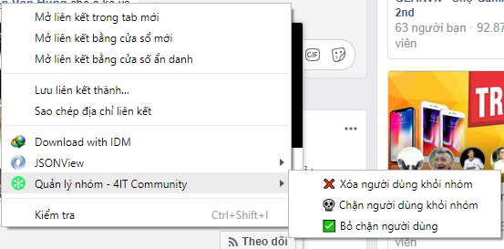
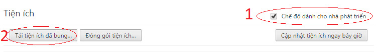

# [4IT Community] Group Management Chrome Extension

Extension hỗ trợ quản lý nhóm trên facebook 1 cách nhanh chóng.


## Các chức năng chính
* ❌ Xóa thành viên khỏi nhóm
* 💀 Chặn thành viên khỏi nhóm
* ✅ Bỏ chặn thành viên
## Cài đặt và cấu hình
* Cấu hình nhóm trong file *bg.js*
```javascript
    /**
     * Id nhóm bạn cần quản lý
     * @type {number}
     */
    GM.group_id=5;
    /**
     * Id bài viết để log thông tin
     * @type {number}
     */
    GM.log_post_id=0;
```
* Load thư mục src vào chrome



## Bản quyền
 GNU General Public License v3
* [COPYRIGHT](COPYRIGHT.txt)
* [LICENSE](LICENSE.txt)
> Bản quyền thuộc về 4IT community. Khi rõ nguồn khi sử dụng lại ứng dụng này. 